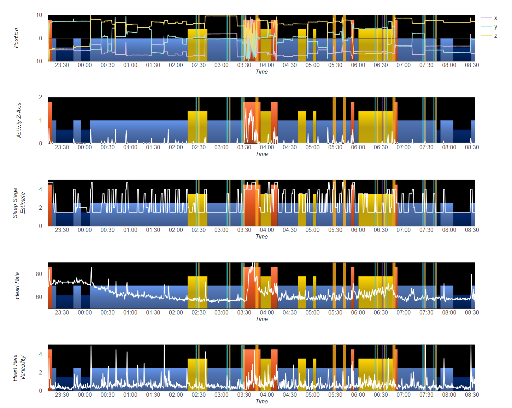

# Charting For Fitbit Lucid Trainer

A collection of node.js scripts to create charts displaying the activity and heart rate data recorded by [Fitbit Lucid Trainer](https://github.com/lucid-trainer/fit-lucid-trainer).

# Getting Started

Install the latest [node.js](https://nodejs.org/en/download/). Clone the repository and create a directory called "staging". Export the data from Fitbit Lucid Trainer (for example with MongoDBCompass if using Atlas as your repository) for a night's session and save in the staging directory as fit-data.json. Authorize and download the corresponding sleep stage data for the night from the [Fitbit Web Api](https://dev.fitbit.com/build/reference/web-api/explore/) and save the file as fit-sleep-stage.json. An example of each file can be found in the [sample](sample) directory.

From the command line or within an IDE like Visual Studio Code run the command "npm run build-charts". A new directory should be created with a name matching the date of the data files. Open the charts.html to view. 

Each chart on the page shows the sleep stages (dark blue for deep, light blue for light, gold for rem and red for awake). The green bars represent dream events reported by the user (with a length of 5-25 minutes specified). The data from one sensor reading is then presented over both. An example charts page is shown below and more examples are available [here](https://lucid-trainer.github.io/).

## License

This application is licensed under the [MIT License](./LICENSE).
